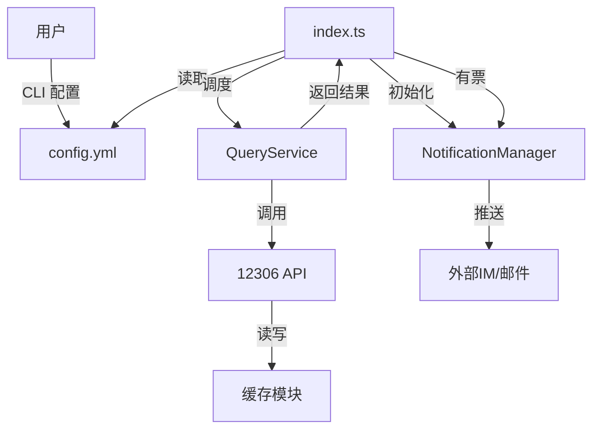

# CRTMonitor 系统设计文档

## 1. 概述
本项目旨在提供一个基于命令行的中国铁路12306余票监控工具，支持定时查询、多种通知方式（飞书、Telegram、企业微信等）、以及冗余站点查询（跨站查询）功能。

为了提高代码的可维护性和扩展性，对现有代码进行模块化重构。

## 2. 模块划分

系统将拆分为以下核心模块：

### 2.1 配置模块 (Config Module)
**职责**：负责配置文件的读取、验证、默认值填充以及类型定义。
**文件**：`src/config.ts`
**关键接口**：
- `interface Config`: 完整的配置结构定义。
- `class ConfigManager`: 单例类，提供 `load()`, `get()` 方法。

### 2.2 缓存模块 (Cache Module)
**职责**：提供通用的内存缓存机制，支持 TTL (Time To Live)。
**文件**：`src/cache.ts`
**关键接口**：
- `class MemoryCache<T>`: 通用缓存实现，支持 `set(key, value, ttl)`, `get(key)`。

### 2.3 核心 API 模块 (Core API Module)
**职责**：封装 12306 的 HTTP 接口调用，处理原始数据解析。
**文件**：`src/cr.ts` (建议重命名为 `src/api/12306.ts`，但在本项目中保留 `cr.ts` 或仅做简化)
**关键接口**：
- `class ChinaRailway`: 静态类或单例，提供 `checkTickets`, `getStationCode`, `getTrainAllStations` 等原子方法。
- 集成 `Cache Module` 缓存站点代码、车次详情等低频变动数据。

### 2.4 查询服务模块 (Query Service Module)
**职责**：处理复杂的业务查询逻辑，包括参数转换、结果过滤、冗余查询策略（向前/向后/双向扩展站点）。
**文件**：`src/service/query.ts`
**关键接口**：
- `class QueryService`:
    - `query(searchConfig)`: 执行一次完整的查询流程。
    - `processExtendQueries(...)`: 处理扩展查询逻辑。

### 2.5 告警模块 (Notification Module)
**职责**：管理多种通知渠道，提供统一的发送接口。
**文件**：`src/notifications.ts`
**关键接口**：
- `interface NotificationProvider`: 通知插件接口。
- `class NotificationManager`: 管理所有激活的通知实例，提供 `sendAll(msg)`。

### 2.6 CLI 交互模块 (CLI Module)
**职责**：处理命令行交互，生成或修改配置文件。
**文件**：`src/cli.ts`
**依赖**：依赖 `Config Module` 的类型定义。

### 2.7 主控与调度模块 (Main/Scheduler Module)
**职责**：程序入口，负责编排各模块，管理定时任务。
**文件**：`src/index.ts`
**逻辑**：
1. 初始化 ConfigManager。
2. 初始化 NotificationManager。
3. 启动定时循环，调用 QueryService。
4. 处理查询结果，触发 NotificationManager 发送告警。

## 3. 数据流向

## 4. 重构步骤
1.  **提取配置**：创建 `src/config.ts`。
2.  **统一缓存**：完善 `src/cache.ts`，并让 API 模块使用它。
3.  **分离查询逻辑**：从 `index.ts` 中提取业务查询逻辑到 `src/service/query.ts`。
4.  **优化通知管理**：在 `src/notifications.ts` 中增加管理器。
5.  **重组入口**：重写 `src/index.ts`。
