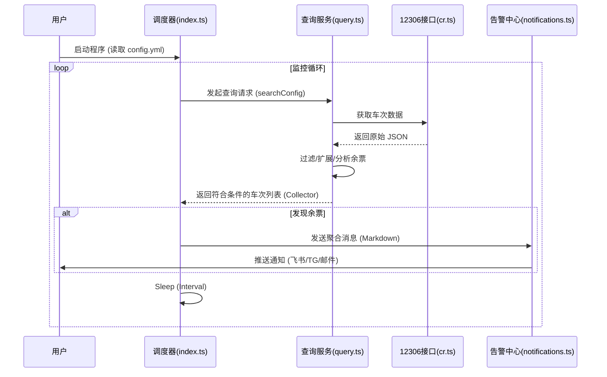

# CRTMonitor 系统设计与流程文档

## 1. 设计目标
构建一个高可维护、模块化、易扩展的 12306 余票监控系统。核心目标是将复杂的业务逻辑拆解为单一职责的模块，实现配置、查询、告警、调度等功能的解耦。

## 2. 系统架构

系统采用 **模块化分层架构**，主要包含以下核心组件：

### 2.1 模块划分

| 模块名称 | 职责描述 | 对应文件 |
| :--- | :--- | :--- |
| **Main (调度器)** | 程序入口，负责编排各模块，管理主循环与定时任务。 | `src/index.ts` |
| **Config (配置中心)** | 单例模式，负责配置文件的加载、热更新与参数校验。 | `src/config.ts` |
| **QueryService (查询服务)** | 封装核心业务逻辑，包括参数转换、余票过滤、冗余站点扩展。 | `src/query.ts` |
| **Notification (告警中心)** | 统一管理多渠道通知（飞书、Telegram等），处理消息格式化与发送。 | `src/notifications.ts` |
| **Cache (缓存层)** | 提供 TTL 内存缓存，减少重复计算与 API 调用频率。 | `src/cache.ts` |
| **API (数据源)** | 封装 12306 原始接口调用与基础数据解析。 | `src/cr.ts` |
| **CLI (交互终端)** | 提供命令行交互界面，辅助生成配置文件。 | `src/cli.ts` |

## 3. 核心业务流程

### 3.1 启动流程
1. **初始化配置**：`ConfigManager` 读取 `config.yml`。
2. **初始化组件**：实例化 `NotificationManager` 和 `QueryService`。
3. **启动调度**：`index.ts` 进入主循环 (`while(isRunning)`)。

### 3.2 监控循环流程 (Main Loop)
对于配置中的每一个监控任务 (`search` in `config.watch`)：

1. **预检查**：校验日期是否有效（未来 15 天内）。
2. **参数转换** (`QueryService.transformSearch`)：
   - 将中文站名（如"北京"）转换为电报码（如"BJP"）。
   - 解析过滤条件。
3. **执行查询** (`QueryService.searchTickets`)：
   - **API 调用**：请求 12306 查票接口。
   - **基础过滤**：根据时间段、车次号、席别筛选结果。
   - **智能扩展**：
     - *主线路检查*：直接检查出发-到达站的余票。
     - *同城/跨站检查*：自动计算向前（多买几站）或向后（少买几站）的方案。
4. **结果收集**：将所有符合条件的车次信息收集到 `collector`。
5. **告警推送**：
   - 如果 `collector` 非空，将多条车次信息合并。
   - 格式化为 Markdown 列表。
   - 调用 `NotificationManager.sendAll` 推送消息。
6. **休眠等待**：根据配置的 `interval` 或 `delay` 等待下一轮。

### 3.3 告警发送流程
1. **接收消息**：接收结构化数据 `{ title, content, time }`。
2. **渠道分发**：遍历所有激活的通知渠道（Lark, Telegram, Wechat 等）。
3. **适配格式**：
   - **Lark (飞书)**：自动封装为**交互式卡片**，支持 Markdown 渲染。
   - **Telegram**：使用 Markdown 模式发送。
   - **其他**：降级为纯文本发送。

## 4. 数据流向图

## 5. 关键设计决策

- **单例配置**：确保全局配置一致性，便于后续支持热重载。
- **依赖注入**：`QueryService` 依赖 `NotificationManager`，但在 `index.ts` 中组装，降低耦合。
- **即时聚合**：单次查询任务内的所有结果合并发送，避免消息轰炸；不同查询任务间独立发送，保证时效性。
- **Markdown 优先**：通知内容全面转向 Markdown 格式，提升阅读体验（支持高亮、链接）。
